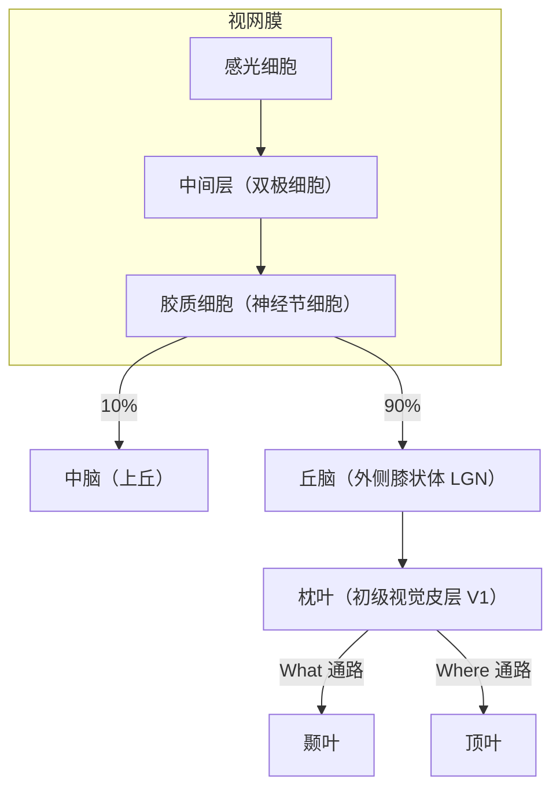
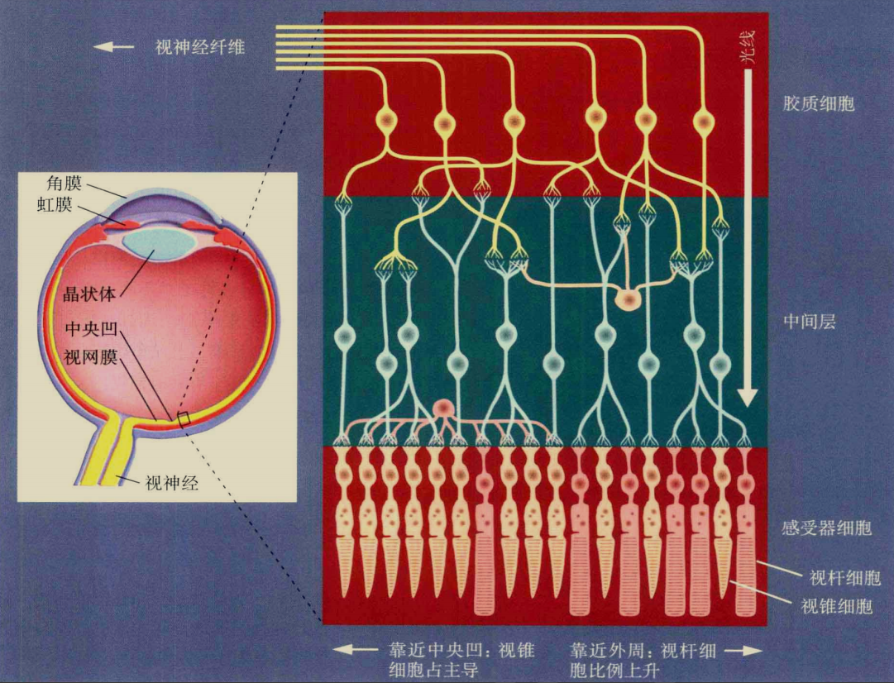
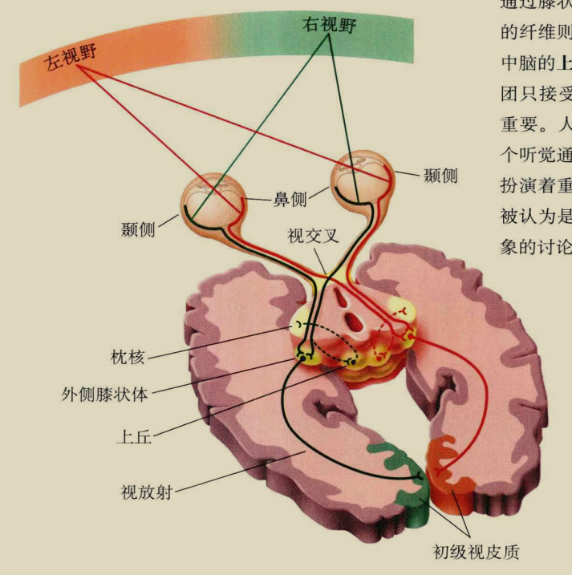

## 视觉
### 神经通路
视觉系统的信息流大致是：

感光细胞分为视锥细胞（颜色敏感）和视杆细胞（弱光敏感）。
感光细胞内有感光色素，这些色素遇光分解放能，引发动作电位。不同的感光色素对不同波段的光线的敏感性不同，依此可以把视锥细胞分为红绿蓝3种。

神经节细胞数量远不及感光细胞，这导致了信息压缩，不过在后期处理中大脑会依据有限的信息进行“脑补”。

视网膜-丘体通路这10%的视神经被认为和盲视现象有关。

| 皮质通路   | 功能                   | 信息输入   | 位置偏好     | 物体偏好             |
| ---------- | ---------------------- | ---------- | ------------ | -------------------- |
| What 通路  | 物体知觉、识别         | 双侧       | 中央凹       | 部分细胞偏好复杂物体 |
| Where 通路 | 空间知觉、分析空间关系 | 主要是单侧 | 中央凹、外周 | 任何物体             |

### 面孔识别
梭状回（尤其是右半球）对面孔知觉起重要作用，它被激活的特定区域被称为梭状回面孔区 FFA。
另外，面孔能引发更大幅度的 N170（[ERP 成分](./研究方法#erp-成分)）。

### 与记忆、想象的关系

## 注意
### 神经机制
### 理论
### ERP 成分

## 记忆
### 理论
### 海马

## 言语
### 字词加工
### 失语症

## 情绪

## 免疫