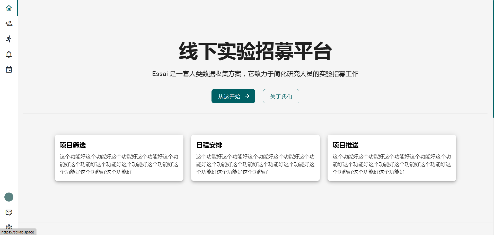
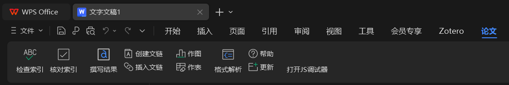
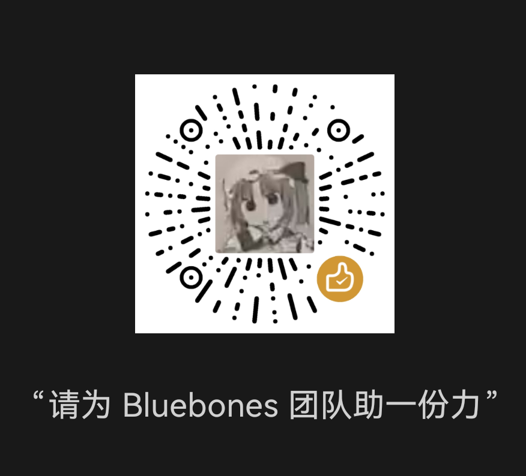

## 简介

蓝骨头（Bluebones），谐音“懒骨头”，是一个非营利性组织，旨在消除科研工作中的一切重复劳动，让科研工作者能够将更多的时间投入到学术思考中。

我们的目标是构建一个针对科研工作者的产品生态，涵盖数据收集、数据分析、结果展示等多个场景，以建立一套高效的科研工作流程。

您还可以通过[项目计划书](项目计划书)了解我们为什么要成立这个组织。

## 成员介绍

我叫肖宜清，上海师范大学心理学院的第一届本科毕业生。
我已经拿到了前端开发的 offer，目前是 Bluebones 的负责人。
主要负责团队中的产品经理、前端开发、项目推广、制作 Python 公开课等工作。

另一个成员是不愿意透露姓名的郭某，上海海事大学计算机专业的本科毕业生。
目前在公司担任全栈工程师，兼职团队中的后端开发。

## 当前成果

### Essai - 线下实验招募平台

详见：https://scilab.space

### wps-paper - 协助写论文的 WPS 加载项

详见：https://github.com/Cubxx/wps-paper

## 未来计划

1. 面向心理学学生的 Python 公开课
2. 制定工作流程规范，以促进科研工作中的团队协作
3. 开发 Python 库，构建数据分析的统一平台
4. 开发排版系统，以简化文字图表的内容排版

详见[项目计划书](项目计划书)

## 支持我们

我们希望成立社会团体以推动我们的目标实现，希望有共同理念的人能加入我们，或向我们捐助。

### 加入

我们的核心工作是产品开发，我们把相关工作分成这些岗位：

1. 产品经理：负责产品提案，与开发岗协商原型设计，处理用户反馈
2. 前端开发：Vue3、TypeScript
3. 后端开发：Express、Koa、SpringBoot
4. 安全测试：找网站漏洞
5. 产品推广：负责产品宣传，与高校对接
6. 产品体验：试用产品，并提意见
7. 财务管理
8. 还有一些很重要但暂时没想到的岗位...

我们团队基本都是学生，所以大多以兼职的形式进行工作。
我们是长期招募的，各岗位都不限人数。在成立社会团体前，都可以无条件加入或退出。

加入我们后，您将获得：

1. Python 公开课的一对一答疑和相关资料
2. 产品开发所有流程的参与经验
3. 我的所有开发技能

或者，也许您不想直接加入我们团队，但还是对我们的工作有兴趣，您也可以加入我们的 QQ 群社区：867356551

### 捐助

在团队初期，接受捐助是我们唯一的收入来源，我们将把这些钱全部用在：

1. 云服务器
2. 域名
3. 产品推广
4. 组织成员补贴

如果您向我们捐助 1 ￥及以上，您将获得以下权益：

1. 收录至赞助者名单
2. 产品内测资格
3. 反馈将被优先考虑
4. 产品的一些高级功能
5. 您可以主动提其他权益...

您可以通过 [爱发电](https://afdian.net/a/bluebones) 或微信赞助码（见下图）向我们捐助，目前我们的捐助目标是把亏损量降至 100 ￥左右。

