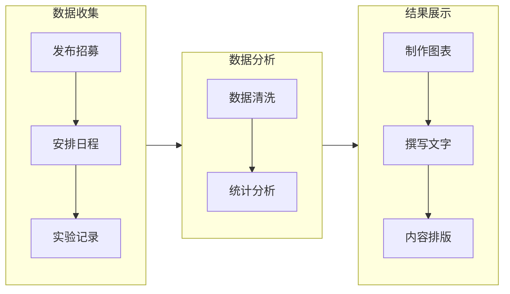
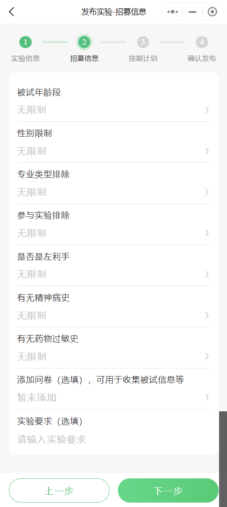
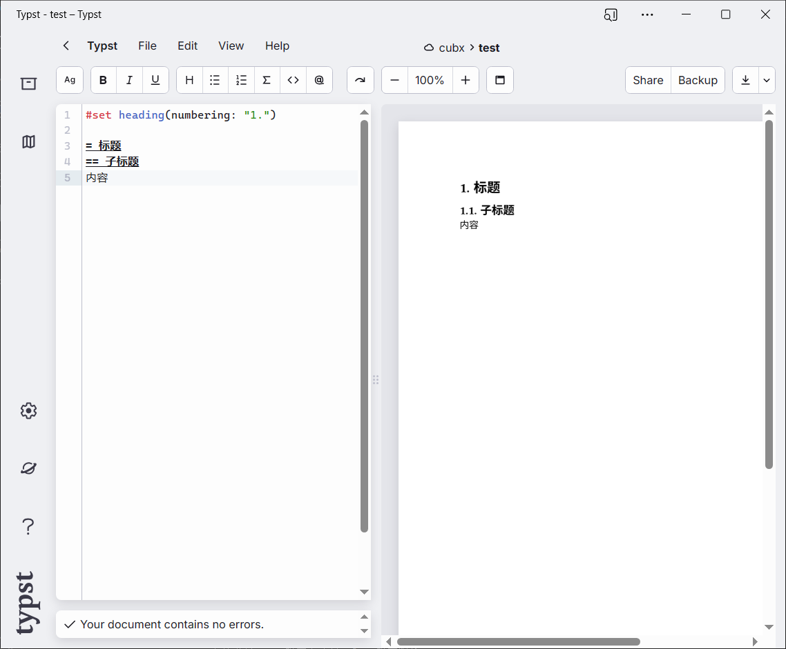

-   [当前科研工作流](#当前科研工作流)
    -   [数据收集](#数据收集)
    -   [数据分析](#数据分析)
    -   [结果展示](#结果展示)
-   [系列产品](#系列产品)
    -   [Essai - 线下实验招募平台](#essai---线下实验招募平台)
    -   [wps-paper - 协助写论文的 WPS 加载项](#wps-paper---协助写论文的-wps-加载项)
    -   [用于数据分析的 Python 库](#用于数据分析的-python-库)
    -   [可导出 Word 文档的排版系统](#可导出-word-文档的排版系统)
-   [总结](#总结)

## 当前科研工作流

在大多数情况中，要开展一个研究项目，
都是大老板先定方向，然后把选题分给小老板们，小老板再把最繁琐的任务分给研究生们。
而这些任务主要包括：收集文献、数据收集、数据分析、撰写文字。

### 数据收集

针对问卷数据收集，市面上已经有一些成熟的产品了：问卷星、credamo 见数。
但是对于实验数据收集，只有[脑岛](https://www.naodao.com/)给出了线上实验数据收集的方案。

实验是科研工作中必要的一部分，在以人为研究对象的学科中，要想招募足够数量的被试并不容易。
在目前的工作流中，“招募难”的原因主要是招募者和参与者的信息不对称：
主试仅能通过被试群发布招募，而大多数潜在被试根本不知道有实验招募这种东西。

#### 线上实验

目前的线上实验方案有 2 种：直接发程序、使用脑岛。

直接发程序就是研究者把程序文件发送给被试安装。
这种方案存在严重安全隐患，在一些重点项目中，实验程序可以被黑客植入病毒，当被试安装实验程序后，病毒程序就能在被试的电脑上发起攻击。
就算实验程序没有被植入病毒，对于一些不擅长使用电脑的被试来说，安装实验程序也是一项艰巨的任务。
所以也有一些研究者采用 QQ 的远程协助功能，即主试通过 QQ 远程操作被试电脑进行程序安装。
总之，这种方案算是非常繁琐的。

于是脑岛开发了一个平台，专注于解决线上实验的问题。
脑岛的基本逻辑是，研究者先在自己电脑上用 psychopy 编写好实验程序，
然后将这个程序转成可以在浏览器中运行的程序，这样就实现了线上实验。
这种方案的弊端也很明显，在浏览器中运行程序可能导致时间精度丢失（感兴趣的可以搜“浏览器的事件循环机制”）。

在脑岛的理念中，线上实验可以提高实验的生态效度，
详见他们在《心理科学》上发的综述[(陈国球等, 2023)](https://doi.org/10.16719/j.cnki.1671-6981.20230529)。
但是，线上实验本身就存在内部效度问题，你永远不知道被试是在什么状态下做实验的。
不过，如果研究者想迅速地收集大量实验数据，脑岛就是一个不可替代的选择。

总之，我们认为线上实验在科研工作中的确可以解决一部分问题，但它永远不能称为主流方案。

#### 线下实验

虽然脑岛的主要卖点是线上实验产品，
但他们在 2023 年 9 月上线了[线下被试招募微信小程序](https://mp.weixin.qq.com/s/iHCb6yOjHmDa0p0oO_JuSA)，
这可能是因为后疫情时期，研究者对线上实验的需求收缩了。

脑岛开发了脑岛测试（被试用）和脑岛科研（主试用）小程序，我们可以先看看脑岛科研的问题。

如图 1，要想发布一个实验，需要填写一些不必要的信息，
如：流程介绍、研究目的，同时也没有提供知情同意书的上传通道。
这样的招募流程是过于繁琐的，在平时研究者发布的招募海报中，只提供基本的时间地点和大致实验内容即可。
少量的核心信息可以方便被试快速筛选出自己心意的实验，而繁琐混乱的信息只会提高被试的认知负荷。
在我们的理念中，平台不应该给招募者设太多限制，如果招募者想提供更多信息，可以写在“项目介绍”中。

脑岛做得比较好的部分是被试筛选，见图 2。
他们实现了根据主试提供的信息从他们的被试库中筛选出相应被试，进行定向投放（credamo 见数也实现了同样功能）。
但是实现筛选的前提是，被试向脑岛提供了自己的人口学数据，而这些数据可能涉及过多个人隐私（国外比较重视这个问题）。
有些被试可能不会提供这些数据，这导致脑岛在进行定向投放时忽视了大量潜在被试。
所以我们认为，应该只收集性别、年龄这种基本人口学信息，同时应该为每个研究者提供自己的被试库，用于定向投放。

图 3 是脑岛的日程安排的功能，很明显，脑岛没有完全解决日程安排的核心问题。
日程安排最繁琐的地方是和被试商量确定实验日程。如果需要招募 30 个被试，每次只能对 1 个被试进行实验，
招募者就需要在脑岛上创建 30 个日程，然后让被试选择某一日程报名。
我们认为这种方案中，研究者的工作量还是太多了。
招募者可以不限死实验日程，而是通过设置实验日程条件以限制被试对实验日程的选择。
比如：被试只能选择某一时间段的日程，或者只能选择主试指定的日程。

针对这些问题，我们团队开发了 [Essai](https://scilab.space) 网站，
详见[Bluebones 系列产品](#系列产品)。

### 数据分析

拿到实验数据后还需要找出无效数据，通常会事先设定一个筛选标准，比如：筛除反应时小于 200ms 的数据。
而在实验范式不同、实验程序不同的情况下，初筛的方法各不相同，有的研究者使用 Excel，有的研究者又偏好 Matlab。

在统计分析阶段也是这样，研究者们可能要先导出初筛后的数据文件，
再使用 Python、 R 语言、SPSS、Amos、Mplus、Matlab 进行统计分析。
这样的结果是研究者需要电脑上打开各种各样的窗口，一个一个地把一个统计结果手动地复制粘贴到 Word 或 PPT 中。
另外，各种各样的研究目的和数据处理软件使得数据分析很难有统一的流程。

于是我们计划构建一个统一的方案，将数据分析的不同步骤连接在一起，仅通过代码实现所有数据操作。

### 结果展示

大多研究员使用 Excel 作图、用 Word 排版。这些软件完全依赖纯手工操作，需要耗费大量时间，尤其是 Word 排版。
理工科常用的排版系统是 Latex，但是 Latex 语法繁琐，学习成本较高，还需要安装相应的编译器。

另一个新兴的排版系统是 [Typst](https://github.com/typst/typst) ，它的目的在于取代 Latex 成为论文排版的主要工具，
但很遗憾的是，它也无法导出为 Word 文档。

我们希望研究者可以只关心文字表述内容，作图、作表、排版等任务交给程序实现。
其中作图、作表可以在数据分析步骤中由系统完成，
对于一些重复的文字表述内容也能通过数据分析结果生成（统计结果汇报部分）。
考虑到目前还没有合适的排版系统，我们打算开发一个线上排版系统用于解决这个问题。

## 系列产品

### [Essai - 线下实验招募平台](https://scilab.space)

这是一个招募网站，正在开发中。
它的目的是解决“招募难”的问题，网站主要有 2 种用户角色：招募者和参与者。

我们扩展了参与者的定义，主试和被试都是一个项目的参与者，这意味着你可以通过这个平台找人帮你主持实验。
我们还为每位招募者提供了参与者库，招募者可以把之前参加过项目的人添加进去，
如果有后续项目可以直接从参与者库发起招募。

同时，我们的日程安排是非常灵活的，可以适用各种需求场景。参与者在报名的时候，就需要选择日程，
选择的日程需要满足招募者制定的日程条件。另外，参与者还可以向招募者申请取消报名或更改日程。

### [wps-paper - 协助写论文的 WPS 加载项](https://github.com/cubxx/wps-paper)

这是一个 wps 加载项，正在维护开发中。
它已经实现了自动作表、撰写结果部分。之后可能将其改造成排版系统。

### 用于数据分析的 Python 库

这是一个 Python 库，还在计划中。
它为数据分析提供了一套完整的解决方案：.csv 作为数据文件格式，各种数据统一交给 Python 进行处理。

为什么是 csv 格式而不是 xlsx 格式呢？

1.  csv 文件占用空间很小。csv 是纯文本格式，所以用记事本也能打开，而 xlsx 文件本质是个压缩包。
2.  csv 文件可以被任何程序读取，包括但不限于 Excel、SPSS、Matlab。

为什么是 Python 而不是其他语言呢？

1. PsychoPy 本身就是 Python 的一个库，通过 pip 安装 PsychoPy 是最简单的安装方式。
2. Python 语法足够简单，它比 C 系列、Java 这种老牌语言更容易上手。
3. Python 是开源的，这使得它有更多的网络资料方便深入学习。
4. Python 生态丰富，这是 Python 成为热门语言的一个很重要的原因。
   从爬虫到 AI，你几乎可以用 Python 做任何事。

在一些细分领域，Python 可能还无法替代其他软件。
所以这个库还提供了与其他软件通信的功能，即通过 Python 调用其他软件，并获取数据处理结果。

### 可导出 Word 文档的排版系统

这是一个线上程序，运行在浏览器里。
它可以将简单语法转化成规范的文档，而不用手动地调整每一部分的格式。

这个排版系统的主要优势是可以导出为 Word 文档，以兼容现有的工作流。
它还支持自定义样式以覆盖默认样式，方便应对各种各样的排版格式要求。

它主要使用 markdown 语法，因为：

1. markdown 语法几乎没有学习成本。
2. markdown 文档也是纯文本文件，占用空间极小。

## 总结

其实科研工作中还有其他重复劳动，有些已经有了成熟的解决方案。
文献管理可以用 Zotero 或 Endnote，文献收集可以用 [kimi](https://kimi.ai)，另外也有许多从文档生成 ppt 的程序。

而我们主要关注的是还有哪些重复劳动是可以用程序替代的，以及如何将现有的方案连通起来形成一条完整的科研工作流程。
出于这样的考虑，我们决定成立 Bluebones 组织。
